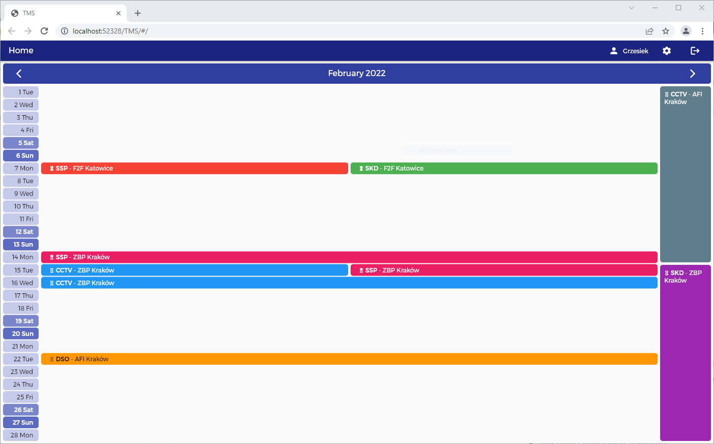

# tms_web_app - Task Management System frontend

A web application designed to manage tasks in an engineering company.  
It is used to manage maintenance of security systems and other installations at various facilities.  
It works with TMS backend server.

## Table of contents

- [Features](#features)
- [Screenshots](#screenshots)
- [Technologies](#technologies)
- [Setup](#setup)
- [Launch](#launch)
- [Test](#test)
- [Insipiration](#inspiration)

## Features

- Authentication
  - sign up
  - sign in
  - reset forgotten password
- Sign up confirmation, reset password confirmation sending by e-mail
- Role based authorization
- Email management
- User management
- Task (service) management
- Monthly schedule visualization
- Field validation
- Error display

## Screenshots

[](_screenshots/tms_web_app_auth.png)
[](_screenshots/tms_web_app_home.png)
[](_screenshots/tms_web_app_task_info.png)
[](_screenshots/tms_web_app_tasks.png)
[](_screenshots/tms_web_app_users.png)
[](_screenshots/tms_web_app_profile.png)

## Technologies

- Dart
- Flutter

## Setup

Clone or download this repository.  
Use the following command to install all the dependencies:

```
flutter pub get
```

Use the following command to update to the latest compatible versions of all the dependencies :

```
flutter pub upgrade
```

Use the following command to create platform-specific folders:

```
flutter create .
```

Create `.env` file in the project root directory with the following code:

```
API_URL=api_url
```

Replace `api_url` with backend server URL.  
If backend server is running locally on port `3000`, set the following value:

```
API_URL=http://localhost:3000/
```

## Launch

To start using the application it must be created collection named `emails` in MongoDB. In this collection it must be created a document with the following data:

```
email: "email"
role: "admin"
```

Replace `email` with valid email address.

Run the application using your IDE or using the following command:

```
flutter run -d chrome
```

## Test

To test `auth` and `task` packages, set connection strings to backend server and MongoDB in the following files:

```
auth/test/helpers.dart
task/test/helpers.dart
```

If backend server is running locally on port `3000`, set the following value:

```
const String API_URL = "http://localhost:3000/";
```

For database connection replace `mongo_db_connection_string` with your MongoDB deployment connection string.

```
const String MONGO_URL = "mongo_db_connection_string";
```

Run the tests using IDE or using the following command:

```
flutter test
```

## Inspiration

This project was based on Island Coder876 tutorial:  
_Full Stack Flutter Development_  
 https://www.youtube.com/playlist?list=PLFhJomvoCKC-HHwfZzIy2Mv59Uen88rqB
